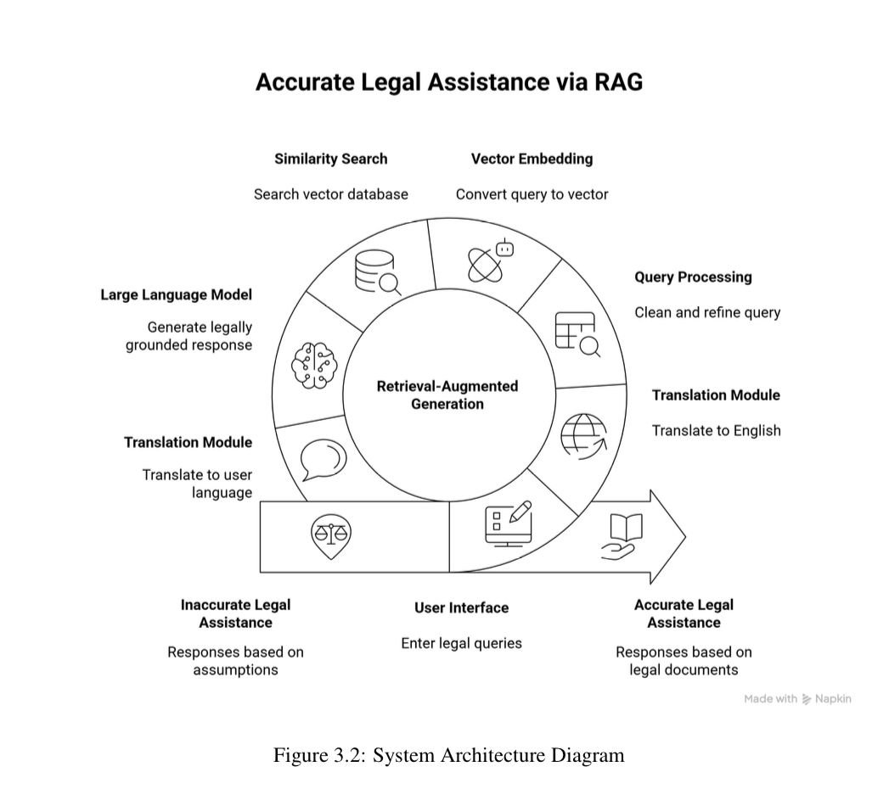
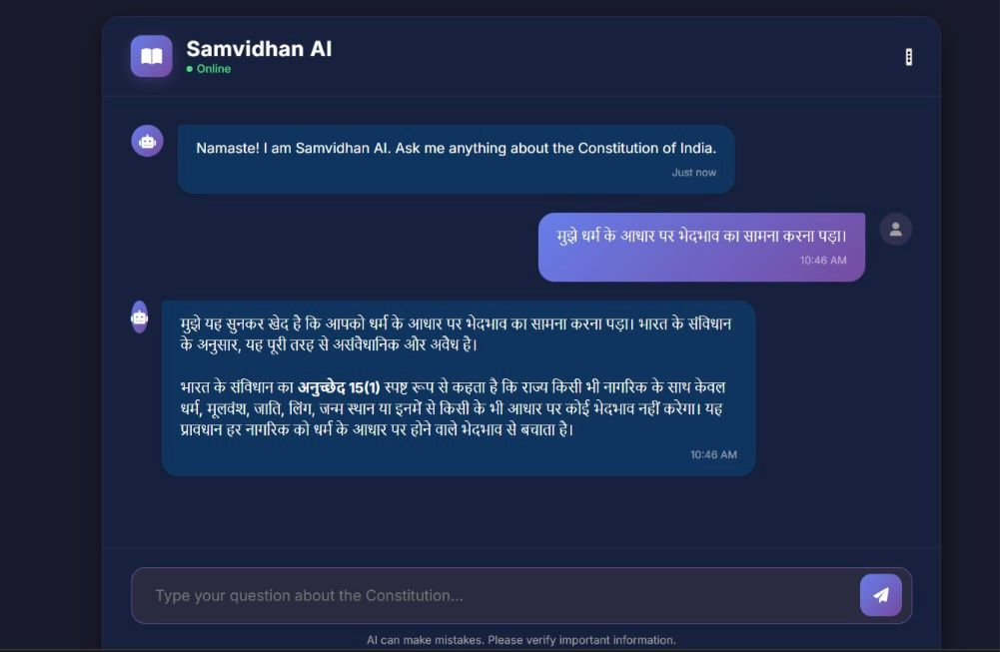
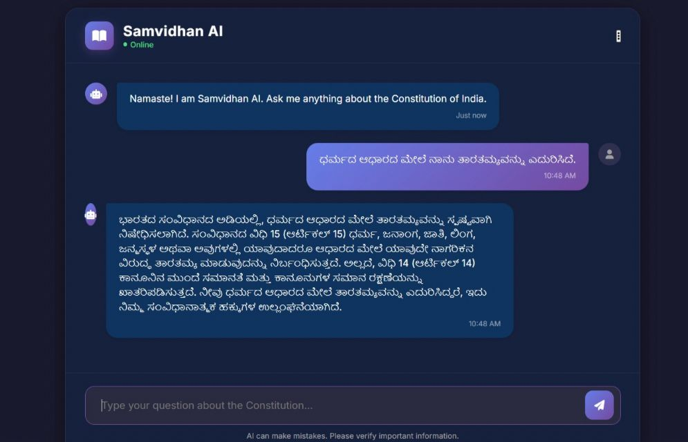
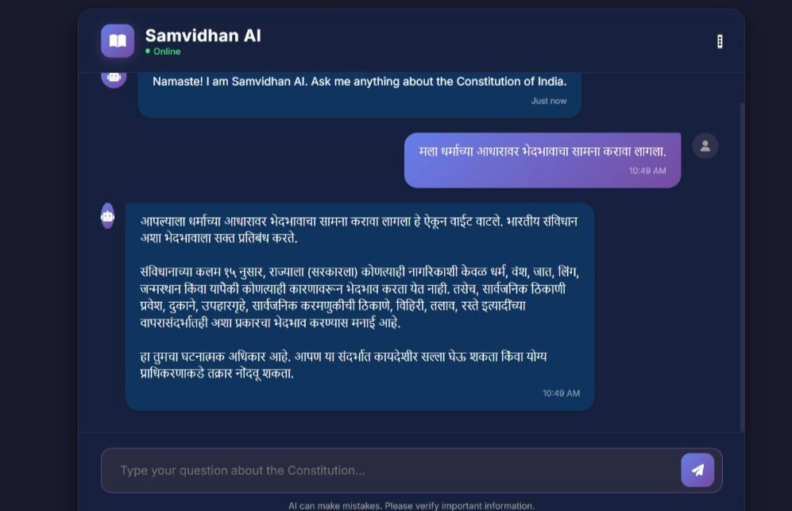

# ⚖️ AI Legal Workflow Automation (Legaily)

## 🚀 Overview

An AI-powered legal assistant system designed to automate legal workflows using Retrieval-Augmented Generation (RAG).
It provides accurate, multilingual legal guidance based on the Indian Constitution.

---

## 🔥 Key Features

* Multilingual legal chatbot (Hindi, Kannada, Marathi)
* RAG-based accurate responses (reduces hallucination)
* Local LLM deployment (privacy-focused)
* Semantic search using ChromaDB
* Fast legal query resolution (seconds instead of hours)

---

## 🛠️ Tech Stack

* Python
* ChromaDB (Vector Database)
* Ollama (Local LLM)
* Sentence Transformers
* Google Deep Translator

---

## 🧠 System Architecture



---
## 🧠 Why RAG?

Traditional LLMs may generate incorrect legal information (hallucinations).
This system uses Retrieval-Augmented Generation (RAG) to fetch real legal context before generating responses, ensuring accuracy and reliability.

---
## 📸 Multilingual Demo Output

### 🇮🇳 Hindi Output


### 🇮🇳 Kannada Output


### 🇮🇳 Marathi Output


---

## ⚙️ How It Works

1. User enters legal query
2. Query translated to English
3. Converted into embeddings
4. Relevant documents retrieved (ChromaDB)
5. LLM generates response
6. Output translated back

---

## ⚙️ Installation & Run

```bash
git clone https://github.com/piyush-047/ai-legal-workflow-automation
cd ai-legal-workflow-automation
pip install -r requirements.txt
python main.py
```

---

## 📊 Results

* Accuracy: ~90%
* Response Time: 2–3 sec
* Multilingual Support: Yes
* Hallucination: Reduced

---

## 🎯 Use Cases

* Legal assistance chatbot
* Judicial system automation
* Legal education
* Government digital services

---

## 📌 Future Improvements

* Add more Indian languages
* Integrate real-time legal updates
* Voice-based legal assistant

---

## 👨‍💻 Author

Piyush Kumar
